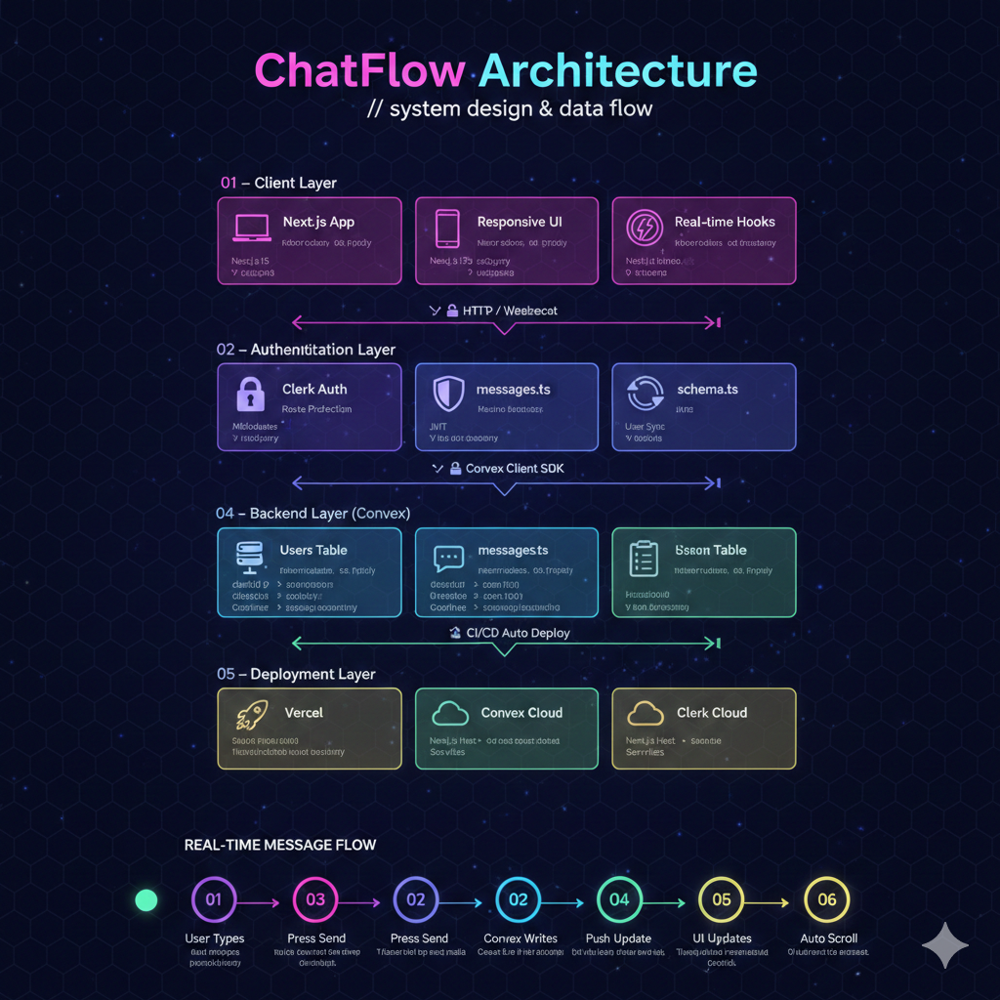

# ChatFlow 💬

A real-time chat application built with Next.js, TypeScript, Clerk, and Convex.

## Live Demo

[chat-flow-ffcr.vercel.app](https://chat-flow-ffcr.vercel.app)

## Architecture :


## Features

- 🔐 **Authentication** — Sign up and login with Clerk
- 💬 **Real-time Messaging** — Messages appear instantly using Convex subscriptions
- 🟢 **Online/Offline Status** — See who is currently online
- ✍️ **Typing Indicator** — Animated dots when someone is typing
- 🔔 **Unread Message Badge** — See how many unread messages you have
- 📅 **Date Separators** — Today, Yesterday, or date for older messages
- ⬇️ **Smart Auto-Scroll** — Auto scrolls to latest message, shows "↓ New messages" button when scrolled up
- 🔍 **Search Users** — Search users by name in the sidebar
- 🕐 **Last Message Preview** — See the last message under each user in the sidebar
- 📱 **Responsive Layout** — Works on both desktop and mobile

## Tech Stack

- **Frontend** — Next.js 15, TypeScript, Tailwind CSS
- **Authentication** — Clerk
- **Backend/Database** — Convex (real-time database)
- **Deployment** — Vercel

## Getting Started

### Prerequisites

- Node.js 18+
- A Clerk account — [dashboard.clerk.com](https://dashboard.clerk.com)
- A Convex account — [dashboard.convex.dev](https://dashboard.convex.dev)

### Installation

1. Clone the repository:
```bash
git clone https://github.com/yourusername/chatflow.git
cd chatflow
```

2. Install dependencies:
```bash
npm install
```

3. Set up environment variables by creating a `.env.local` file:
```
NEXT_PUBLIC_CLERK_PUBLISHABLE_KEY=pk_test_...
CLERK_SECRET_KEY=sk_test_...
NEXT_PUBLIC_CONVEX_URL=https://your-dev.convex.cloud
CONVEX_DEPLOYMENT=dev:your-deployment
```

4. Start Convex development server:
```bash
npx convex dev
```

5. Start the Next.js development server:
```bash
npm run dev
```

6. Open [http://localhost:3000](http://localhost:3000) in your browser.

## Project Structure

```
chatflow/
├── app/
│   ├── layout.tsx          # Root layout with Clerk and Convex providers
│   ├── providers.tsx        # Client providers (Convex + Clerk)
│   ├── page.tsx            # Home/dashboard page
│   ├── sign-in/            # Clerk sign-in page
│   └── sign-up/            # Clerk sign-up page
├── components/
│   ├── SideBar.tsx          # Sidebar with user list and search
│   ├── ChatContainer.tsx    # Main chat area
│   ├── SyncUser.tsx         # Syncs Clerk user to Convex DB
│   ├── OnlineTracker.tsx    # Tracks online/offline status
│   ├── UnreadBadge.tsx      # Unread message count badge
│   └── LastMessage.tsx      # Last message preview in sidebar
├── convex/
│   ├── schema.ts            # Convex database schema
│   ├── users.ts             # User queries and mutations
│   └── messages.ts          # Message queries and mutations
└── public/
    ├── chat.png             # Default chat illustration
    ├── search.png           # Search icon
    └── send.png             # Send button icon
```

## Database Schema

### Users Table
| Field | Type | Description |
|-------|------|-------------|
| clerkId | string | Clerk user ID |
| name | string | Full name |
| email | string | Email address |
| image | string | Profile picture URL |
| isOnline | boolean (optional) | Online status |
| isTyping | boolean (optional) | Typing status |

### Messages Table
| Field | Type | Description |
|-------|------|-------------|
| senderId | string | Clerk ID of sender |
| receiverId | string | Clerk ID of receiver |
| content | string | Message text |
| createdAt | number | Timestamp |
| read | boolean (optional) | Read status |

## Deployment
Deployed to vercel.


